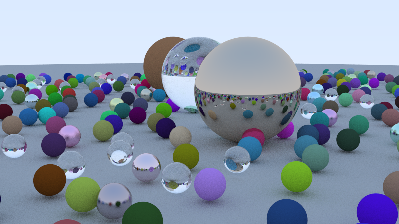

# GPU Ray Tracer (Metal)

A path tracer written in Metal compute shaders, ported from a CPU renderer I built from scratch. The goal wasn't just to make it run on the GPU, but to measure what changes and understand why.

## What this is

I first built a full CPU path tracer following Peter Shirley's *Realistic Ray Tracing*, then ported the core to the GPU with Metal. Porting a ray tracer to the GPU isn't a copy-paste job. Three things had to change, and each is a real GPU constraint:

**Recursion became a loop.** The CPU tracer called itself to follow bounces. GPUs have no real call stack, so the recursive trace was rewritten as an iterative loop that carries a running throughput value forward.

**Objects became flat data.** The CPU scene was a tree of objects with virtual functions and pointers. None of that exists on the GPU. Spheres and BVH nodes became flat structs, and the BVH tree was flattened into an array where children are indices, not pointers.

**Randomness became per-thread.** No std::mt19937 on the GPU. Each thread seeds its own hash-based RNG from its pixel coordinates, so thousands of threads get independent random streams.

## Measurements

All on an Apple M2 Pro.

GPU vs 12-thread CPU (identical 5-sphere scene, 800x450, 200 spp, 30 bounces):

| | Time |
|---|---|
| CPU (12 threads) | 652 ms |
| GPU | 63 ms |
| Speedup | 10.4x |

BVH vs brute force on the GPU (488 spheres, 800x450, 100 spp):

| | Time |
|---|---|
| Brute force | 2174 ms |
| BVH | 302 ms |
| Speedup | 7.2x |

## The interesting finding

The BVH gave roughly 15x on the CPU but only 7.2x on the GPU for the same algorithm. The reason is warp divergence: GPU threads run in lockstep groups, but neighboring rays take different paths through the BVH tree, so the hardware runs both branches and masks off the wrong results. The acceleration structure that helps the CPU partially fights the GPU's execution model.

This is exactly why modern GPUs ship dedicated ray-tracing hardware (RT cores) whose job is to traverse BVHs without paying the divergence penalty.

## A bug worth mentioning

My first GPU render came out blank, with no error. The cause was struct alignment: a float3 is 16 bytes on the GPU, not 12, so my CPU and GPU structs disagreed on layout and the GPU read garbage for the sphere positions. Switching to float4 packing fixed it. GPU code fails silently, so this kind of thing produces a wrong image rather than a crash.

## Building

Requires macOS with the Metal toolchain. Download Apple's metal-cpp into this folder, then:

    ./build.sh && ./raytracer

cpu_bench.cpp is the CPU baseline used for the comparison.